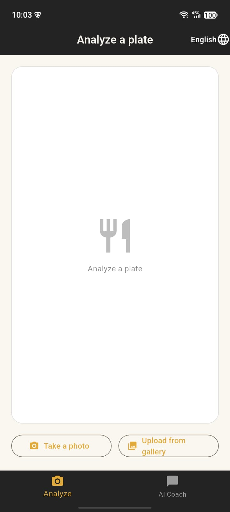
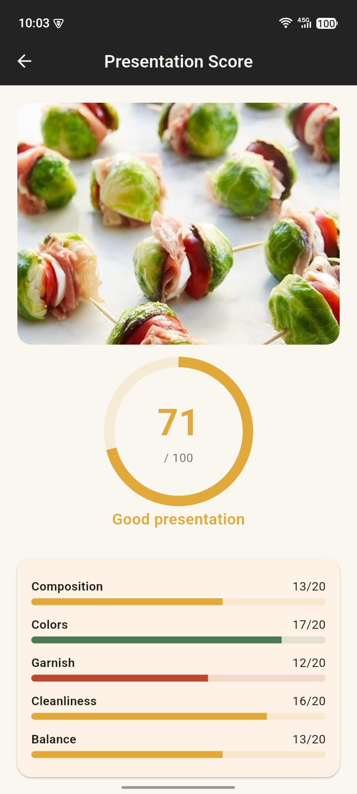
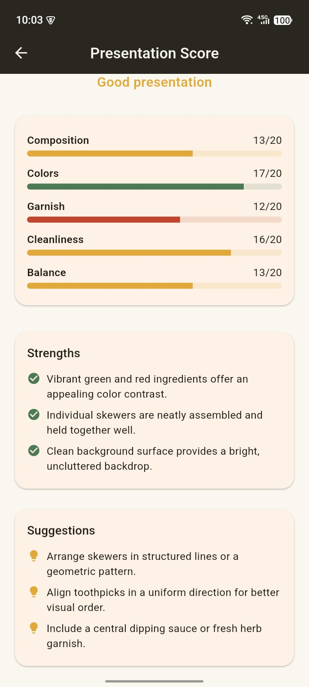
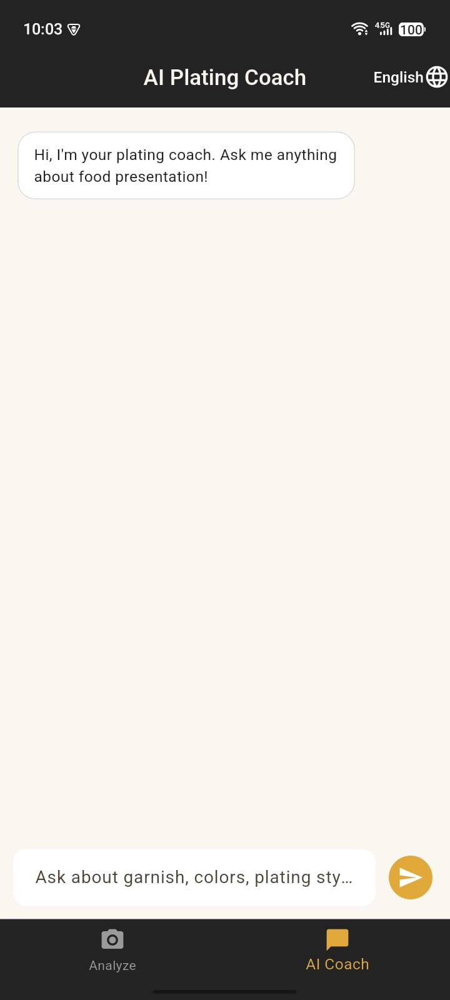
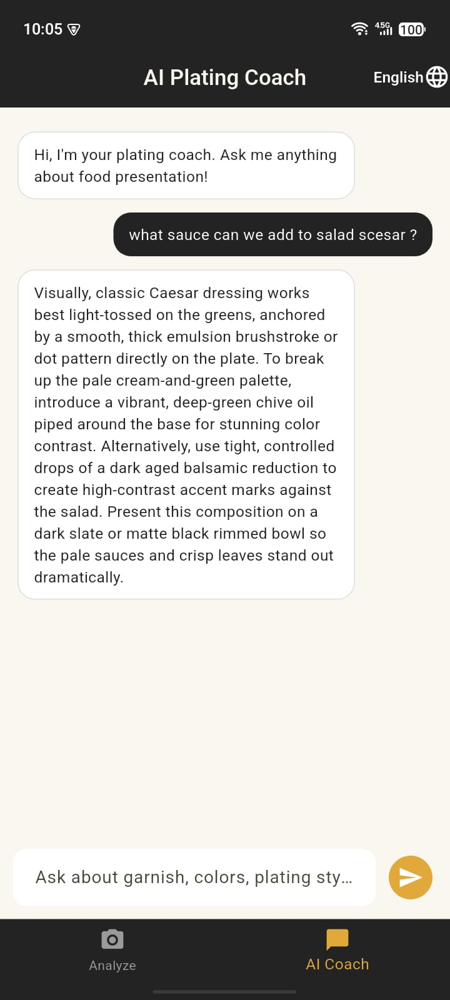

<div align="center">

# 🍽️ AI Plating Assistant

### An AI-powered plate-presentation coach for Flutter — scored by Gemini Vision

Take a photo of your plated dish and get an instant score on composition,
color harmony, garnish, cleanliness, and balance — plus concrete strengths
and suggestions. Ask the built-in coach for plating tips anytime.


</div>

<br>

## 📱 Screenshots

<div align="center">
<table>
  <tr>
    <td align="center" width="33%">
      <br>
      <sub><b>Home</b></sub>
    </td>
    <td align="center" width="33%">
      <br>
      <sub><b>Score & feedback</b></sub>
    </td>
    <td align="center" width="33%">
      <br>
      <sub><b>Score & feedback</b></sub>
    </td>
  </tr>
  <tr>
    <td align="center" width="33%">
      <br>
      <sub><b>Coach chat </b></sub>
    </td>
    <td align="center" width="33%">
      <br>
      <sub><b>Coach chat </b></sub>
    </td>
  </tr>
</table>
</div>

<br>

## ✨ Features

- 📸 **Capture or upload** a photo of your plated dish
- 🤖 **AI scoring out of 100**, broken into 5 subscores — composition, colors, garnish, cleanliness, balance
- ✅ **Strengths** and 💡 **suggestions** generated for every photo
- 💬 **Plating coach** — a text chat for plating/presentation questions
- 🌍 **Multilingual** — English, French, and Arabic
- 🔒 **No accounts, no history, no image storage** — see below
- 🎨 **Clean, food-forward UI**

<br>

## 🛠️ Built with

| Purpose | Package |
|---|---|
| AI vision & chat | [Google Gemini API](https://ai.google.dev/) |
| Photo capture | [`image_picker`](https://pub.dev/packages/image_picker) |
| Networking | [`http`](https://pub.dev/packages/http) |
| State management | [`provider`](https://pub.dev/packages/provider) |
| Localization | `flutter_localizations` + [`intl`](https://pub.dev/packages/intl) |
| Language preference | [`shared_preferences`](https://pub.dev/packages/shared_preferences) |

<br>

## 🔒 Note on privacy

This app is intentionally **stateless**. There are no accounts, no login,
and no history. A plate photo lives only in memory for as long as it takes
to send it to Gemini and show the result — it's never written to disk,
never uploaded to cloud storage, and never saved in a database. Closing
the app or picking a new photo simply discards the previous one. The
only network call the app makes is the one-shot analysis request to the
Gemini API itself.

<br>

## 🚀 Getting started

### Prerequisites

- [Flutter SDK](https://docs.flutter.dev/get-started/install) (>=3.3.0)
- A free Gemini API key from [Google AI Studio](https://aistudio.google.com/app/apikey)

### Setup

```bash
# 1. Clone the repo
git clone https://github.com/<your-username>/ai_plating_assistant.git
cd ai_plating_assistant

# 2. Install dependencies
flutter pub get

# 3. Add your Gemini API key
cp lib/config/api_config.example.dart lib/config/api_config.dart
#    then open lib/config/api_config.dart and paste your key:
#    static const String geminiApiKey = 'YOUR_GEMINI_API_KEY';

# 4. Run on a connected device or emulator
flutter run
```

> `lib/config/api_config.dart` is git-ignored on purpose — never commit
> your real key.

<br>

## 📂 Project structure

```
lib/
├── config/         # API key config (api_config.dart is git-ignored)
├── l10n/           # Localization (ARB files + generated classes)
├── models/         # AnalysisResult, Subscores
├── screens/        # Capture, Result, Coach, Home
├── services/       # GeminiService, LocaleProvider
├── theme/          # App-wide theme
└── widgets/        # ScoreRing, SubscoreBar, LanguageSelector
```

<br>

## 🗺️ Roadmap ideas

- Optional local-only history (on-device, opt-in, no cloud)
- More granular plating criteria per cuisine style
- Side-by-side comparison of two plates

<br>

## 🤝 Contributing

Issues and pull requests are welcome. If you spot a bug or have an idea,
feel free to open an issue.

## 📄 License

This project is licensed under the MIT License — see the
[LICENSE](LICENSE) file for details.

<br>

<div align="center">
<sub>Made with 💜 and Flutter</sub>
</div>

---

## 👤 Author

**Ghofrane BM**
Flutter Developer

---

## ⭐ Support

If you like this project, feel free to **star ⭐ the repository**!
